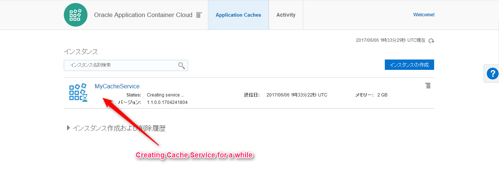

# Using Application Caches in Oracle Application Container Cloud Service


Oracle Application Container Cloud Service features Application Cache with in-memory which is clusterd, scalable and resilient.
This sample show how to use it with Java API.

## Description

Application Cache in Oracle Application Container cloud Serivice is easy to start. All you have to do is that you specify the data capacity.
The cache service has the following rule:

- One cache service can have multiple cache within it
- Multipe applications can use the same one cache service and multiple caches within it.

You can use the cache with Java API or REST API.

## Demo

## Features

- Data in cahce service is replicated among cluster members
- Cache service is scalable

## Requirement

Application Cache Client needs the following dendency in Maven:

- Artifact ID: **cache-client-api**
  - Group ID: **com.oracle.cloud.caching**

```xml
<dependency>
    <groupId>com.oracle.cloud.caching</groupId>
    <artifactId>cache-client-api</artifactId>
    <version>1.0.0</version>
</dependency>
```

## Usage
The following code shows how to use cache instead of session.

### Case of HttpSession

When you put the session object, you generally do below:

```java
HttpSession session = request.getSession(true);
session.setAttribute("KEY", "1");
```

When you get it:

```java
String value = (String) session.getAttribute("KEY");
```

### Case of Cache (com.oracle.cloud.cache.basic.Cache)

#### 1. Initialization

First you should get cache from remote cache service before you use cache:

```java
import com.oracle.cloud.cache.basic.Cache;
import com.oracle.cloud.cache.basic.RemoteSessionProvider;
import com.oracle.cloud.cache.basic.Session;
import com.oracle.cloud.cache.basic.options.Transport;
import com.oracle.cloud.cache.basic.options.ValueType;

String CACHE_HOST = System.getenv("CACHING_INTERNAL_CACHE_URL");
String CACHE_URL = "http://" + CACHE_HOST + ":8080/ccs/";
String CACHE_NAME = "sample";

Session cacheSession = new RemoteSessionProvider(CACHE_URL).createSession(Transport.rest());
Cache cache = cacheSession.getCache(CACHE_NAME, ValueType.of(String.class));
```

- Get caching service host name from environmet variable *`CACHING_INTERNAL_CACHE_URL`*:
  - `String CACHE_HOST = System.getenv("CACHING_INTERNAL_CACHE_URL");`


- Get SessionProvider for cache
  - `RemoteSessionProvider(CACHE_URL).createSession(Transport.rest());`
    - **Transport.rest()**: REST API
    - **Transport.grpc()**: GRPC API

#### 2. Cache Operation
- Create
  - `cache.put("KEY", "VALUE")`
- Read
  - `cache.get("KEY")`
- Update
  - `cache.replace("KEY", "VALUE")`
- Deleate
  - `cache.remove("KEY")`

## Installation
### 1. Create Cache Service
#### 1.1. Select Application Cache


Select **Application Cache** from menu.

#### 1.2. Create Instance


Click **Create Instance**.

#### 1.3. Configure cache capacity and configuration


- Basic: **Only One** container is created for the cache server
- Recommended: **Three or more** containers are created for the cache container

#### 1.4. Confirmation


#### 1.5. Creating



#### 1.6. Application Cache is completed


### 2. Deploy Application
#### 2.1. Select Application


Select **Application** from menu.

#### 2.2. Create Application


Click **Create Application**

#### 2.3. Select Platform


Select **Java SE**.

#### 2.4. Select Application


Select an application which is put on the following URL:

- [https://github.com/shinyay/oracle-accs-cache-api/releases/download/v1.0.0/cache-sample-1.0.0-SNAPSHOT.zip](https://github.com/shinyay/oracle-accs-cache-api/releases/download/v1.0.0/cache-sample-1.0.0-SNAPSHOT.zip)

Click **Create**.

### 3. HttpSession
#### 3.1. Access session application


Click the URL displayed on the dashboard.

#### 3.2. 1st access


#### 3.3. 2nd access


#### 3.4. 3rd access


#### 3.5. Restart application


#### 3.6. 4th access after restart


Session is initilized since session object is not persisted.

### 4. Cache
#### 4.1. 1st access


Access URL which is replaces context root as `cache`, which is running cache servlet.

#### 4.2. 2nd access


#### 4.3. 3rd access


#### 4.4. Restart application


#### 4.5. 4th access


caching data is persisted on Application Cache. Hence count is persisted.

### 5. Clustering with cache
#### 5.1. Create Same application


Create same application as already created.

#### 5.2. Access cache servlet


Access a new application created with cache servlet URL.

#### 5.3. Clustered with cache


Other node shares caching data.

## Licence

Released under the [MIT license](https://gist.githubusercontent.com/shinyay/56e54ee4c0e22db8211e05e70a63247e/raw/44f0f4de510b4f2b918fad3c91e0845104092bff/LICENSE)

## Author

[shinyay](https://github.com/shinyay)
