# Using Application Caches in Oracle Application Container Cloud Service

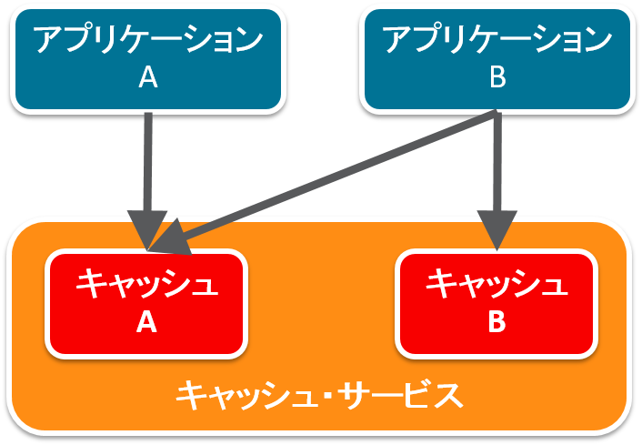

Oracle Application Container Cloud Service は、キャッシュ機能は提供しています。これを利用して、アプリケーションのクラスタリングや、データベース・アクセスの代用などが行えるようになります。

## 説明

Oracle Application Container Cloud Service のキャッシュ機能は簡単に利用できます。キャッシュ・サービスの作成は、キャッシュに利用する容量の設定のみで完了します。

このキャッシュ機能のアクセスには、以下の２つの方法が提供されています。

- **REST API**
- **Java API**

**REST API** は、Jersey などのREST Client API を用いて、キャッシュサービスが提供しているREST APIを直接利用する方法です。

**Java API** は、オラクルが提供しているライブラリを使用してアプリケーション内からキャッシュ・サービス用のAPI を利用する方法です。以下の手順では、このJava API による方法を説明しています。

簡単に利用開始できるキャッシュ・サービスですが、以下の使用ルールがあります:

- １つのキャッシュサービスの中に複数のキャッシュを作成可能
- あるアプリケーションから同時に利用できるキャッシュ・サービスは１つです。（キャッシュ・サービス内のキャッシュは複数利用可能）
- あるキャッシュ・サービスは同時に複数のキャッシュ・サービスから利用可能

## 機能

- キャッシュ・データはクラスタ・メンバ内で複製がとられる
  - あるキャッシュが壊れてしまったとしても、別のキャッシュからの自動復旧が可能
- キャッシュ・サービスの再起動時もデータは保存
- スケーラブルな構成

## 前提

キャッシュ・サービスのクライアント・アプリケーションに Java API を利用する場合は、以下のライブラリが必要になる。

- cache-client-api-1.0.0.jar

Maven により以下の依存関係を記述することで取得可能:

- Artifact ID: **cache-client-api**
  - Group ID: **com.oracle.cloud.caching**

```xml
<dependency>
    <groupId>com.oracle.cloud.caching</groupId>
    <artifactId>cache-client-api</artifactId>
    <version>1.0.0</version>
</dependency>
```

## 使用方法

HttpSession と Cache を用いたセッション保持の方法を例に使用方法を以下で説明しています。

### HttpSession の場合

HttpSession を利用してセッションを保持する場合は、一般的に以下のようにコードを記述します:
#### セッションオブジェクトの取得とデータの設定

```java
HttpSession session = request.getSession(true);
session.setAttribute("KEY", "1");
```

#### セッションデータの取得

```java
String value = (String) session.getAttribute("KEY");
```

### Cache (com.oracle.cloud.cache.basic.Cache) の場合

#### 1. 初期化

まずキャッシュ・サービス上からキャッシュを取得、また存在しない場合はキャッシュの作成を行います。

```java
import com.oracle.cloud.cache.basic.Cache;
import com.oracle.cloud.cache.basic.RemoteSessionProvider;
import com.oracle.cloud.cache.basic.Session;
import com.oracle.cloud.cache.basic.options.Transport;
import com.oracle.cloud.cache.basic.options.ValueType;

String CACHE_HOST = System.getenv("CACHING_INTERNAL_CACHE_URL");
String CACHE_URL = "http://" + CACHE_HOST + ":8080/ccs/";
String CACHE_NAME = "sample";

Session cacheSession = new RemoteSessionProvider(CACHE_URL).createSession(Transport.rest());
Cache cache = cacheSession.getCache(CACHE_NAME, ValueType.of(String.class));
```

キャッシュ・サービスの URL は、環境変数から取得します。使用する環境変数は、**`CACHING_INTERNAL_CACHE_URL`** です。これを、`System.getenv()` を使用して、値を取得します。

- `String CACHE_HOST = System.getenv("CACHING_INTERNAL_CACHE_URL");`

キャッシュにアクセスする方式は以下の２つから選択できます:

- REST API
- gRPC

以下のように Session オブジェクトを生成する際に **Transport** を用いて設定を行います:

- `RemoteSessionProvider(CACHE_URL).createSession(Transport.rest());`
  - **Transport.rest()**: REST API
  - **Transport.grpc()**: GRPC API

#### 2. キャッシュ操作

以下のようにキャッシュに対するデータの追加 / 参照 / 更新 / 削除

- 追加
  - `cache.put("KEY", "VALUE")`
- 参照
  - `cache.get("KEY")`
- 更新
  - `cache.replace("KEY", "VALUE")`
- 削除
  - `cache.remove("KEY")`

## Application Cache の環境作成、及びアプリケーションの実行例
### 1. キャッシュ・サービスの作成
#### 1.1. Application Cache の選択

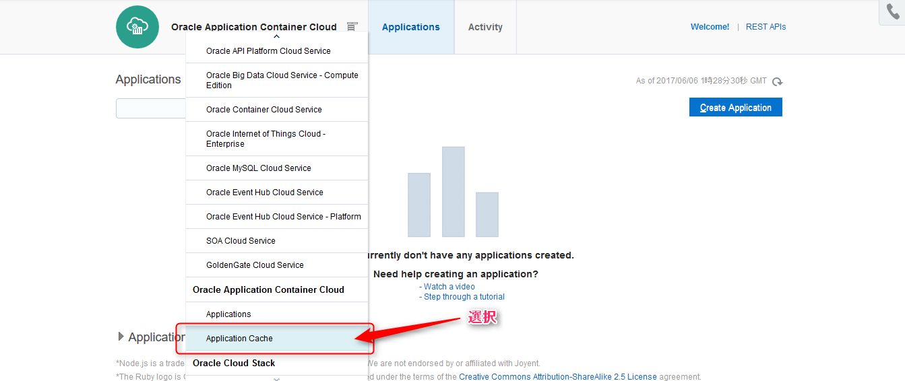

メニューから **Application Cache** を選択します。

#### 1.2. キャッシュ・サービス・インタンスの作成

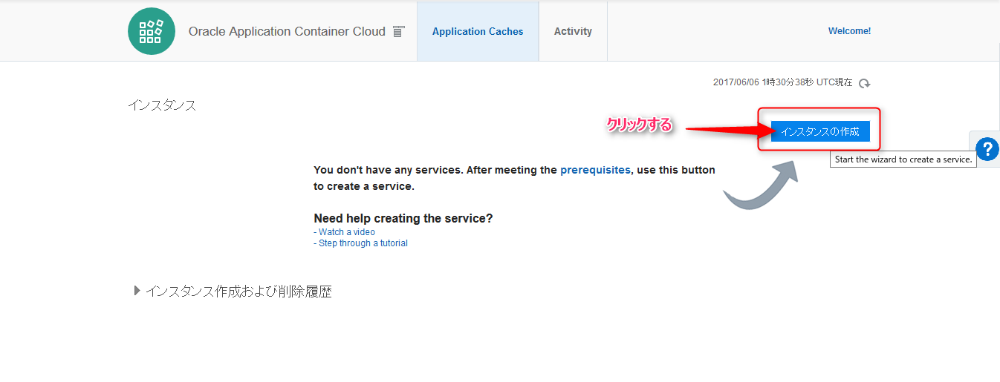

**インスタンスの作成** をクリックします。

#### 1.3. キャッシュの構成及び容量の設定

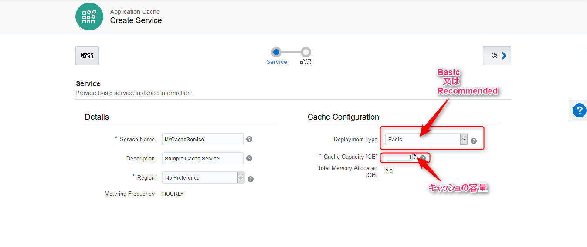

- Basic: **１つだけ** キャッシュ用のコンテナが差作成されます。
- Recommended: **３つ以上** のキャッシュ用のコンテナが作成されます。

#### 1.4. 確認画面

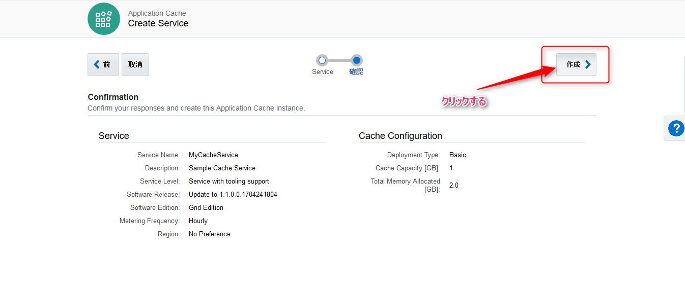

#### 1.5. 作成中画面

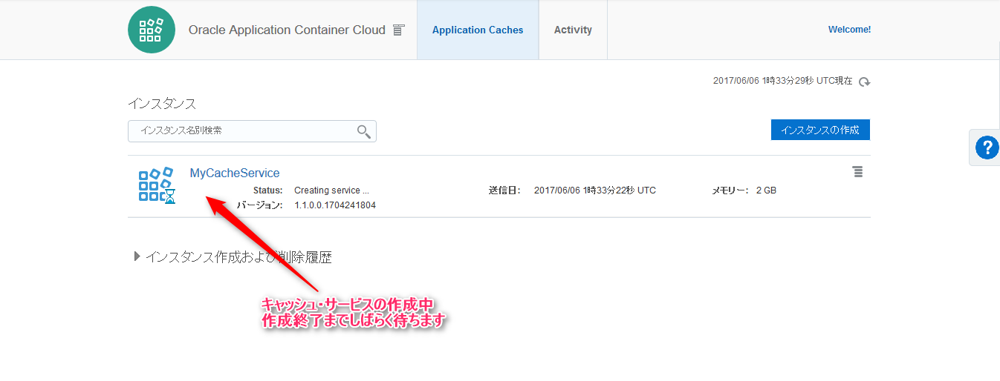

#### 1.6. キャッシュ・サービス作成完了

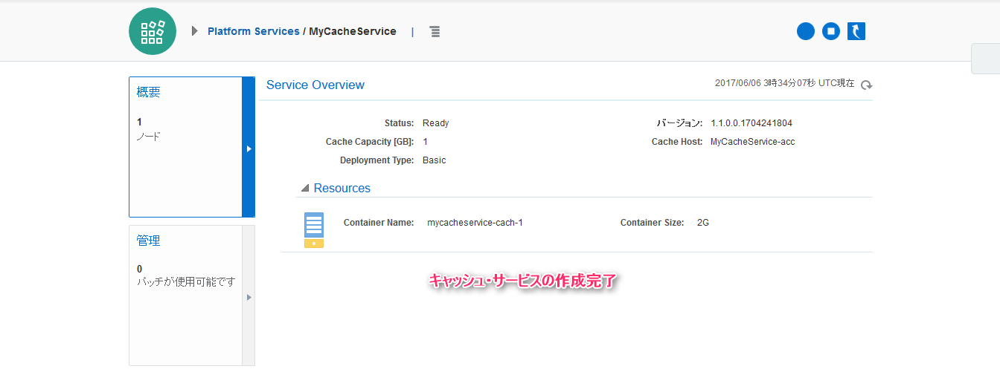

### 2. サンプル・アプリケーションのデプロイ
#### 2.1. Application の選択

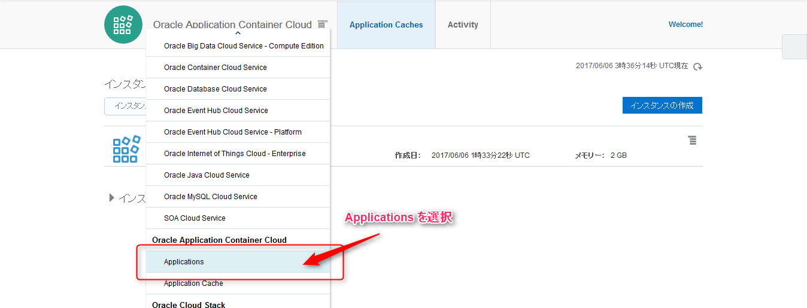

メニューから **Application** を選択します。

#### 2.2. Application のデプロイ

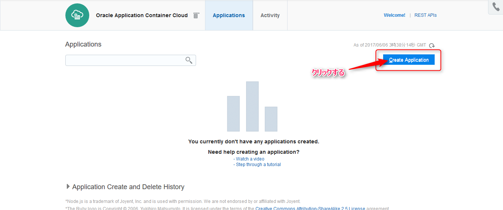

**Create Application** をクリックします。

#### 2.3. ランタイムの選択

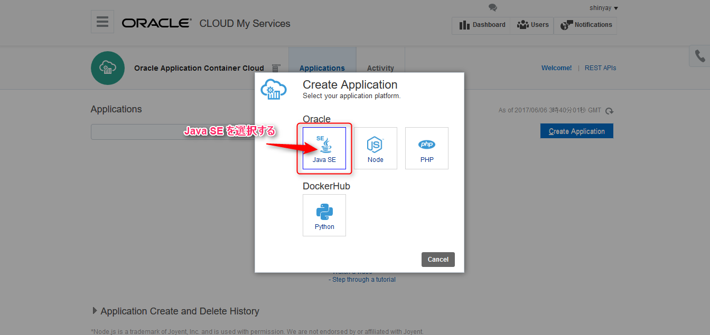

**Java SE** を選択します。

#### 2.4. デプロイ対象アプリケーションの選択

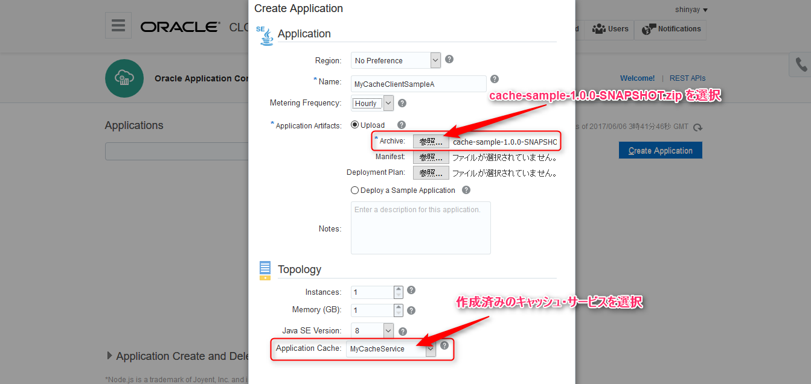

以下の URL からダウンロードしたアプリケーションを選択します
:

- [https://github.com/shinyay/oracle-accs-cache-api/releases/download/v1.0.0/cache-sample-1.0.0-SNAPSHOT.zip](https://github.com/shinyay/oracle-accs-cache-api/releases/download/v1.0.0/cache-sample-1.0.0-SNAPSHOT.zip)

画面下部の選択肢で、作成済みのキャッシュ・サービスを選択します。

**Create** をクリックします。

### 3. HttpSession を用いた動作
#### 3.1. サンプル・アプリケーションにアクセス

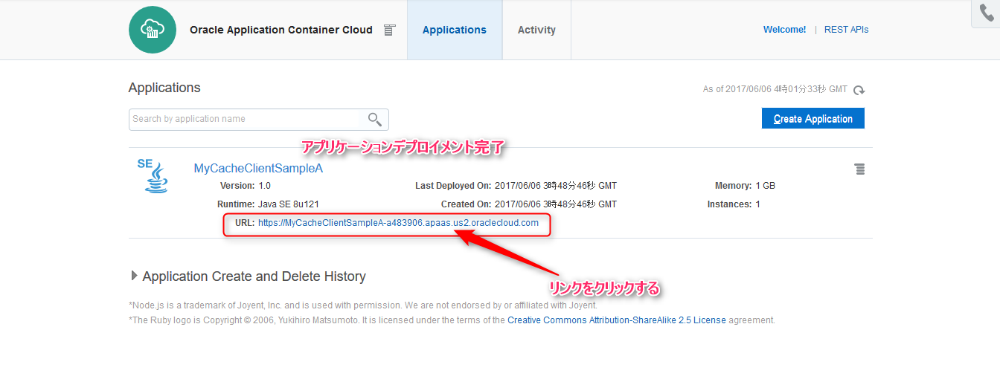

ダッシュボード画面に表示されている URL をクリックします。このURLからアクセスするアプリケーションは、HttpSession を使用してアクセス数をカウントアップしていきます。

#### 3.2. 初回アクセス


#### 3.3. ２回目のアクセス


#### 3.4. ３回目のアクセス


#### 3.5. アプリケーションの再始動

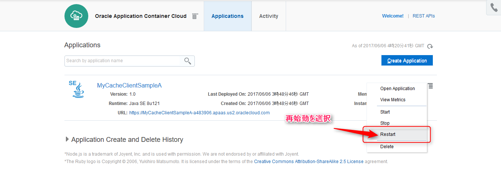

メニューから **Restart** をクリックします。

#### 3.6. 再始動後の４回目のアクセス


セッション・データは永続化されていないため、再始動によりセッションが初期化されています。そのため、再び **初回アクセス** として表示されます。

### 4. Cache を用いた動作
#### 4.1. 初回アクセス


コンテキストルートを **cache** としてアクセスします。

- /session : HttpSession 動作の Servlet
- /cache : Cache 動作の Servlet

#### 4.2. ２回目のアクセス


#### 4.3. ３回目のアクセス


#### 4.4. アプリケーションの再始動


#### 4.5. 再始動後の４回目のアクセス


アクセス・カウント情報は、キャッシュとしてキャッシュ・サービス上に保存されているため、再始動後も続けてカウントアップしています。

### 5. キャッシュを用いたクラスタリング
#### 5.1. 同じアプリケーションを別名でデプロイ

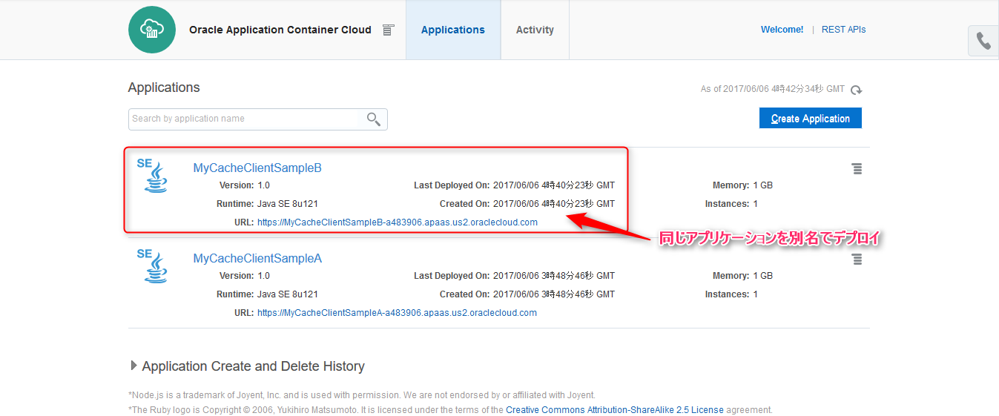

名称を変えて同じアプリケーションをデプロイします。先の手順と同様にキャッシュ・サービスを選択します。

#### 5.2. サンプル・アプリケーションにアクセス

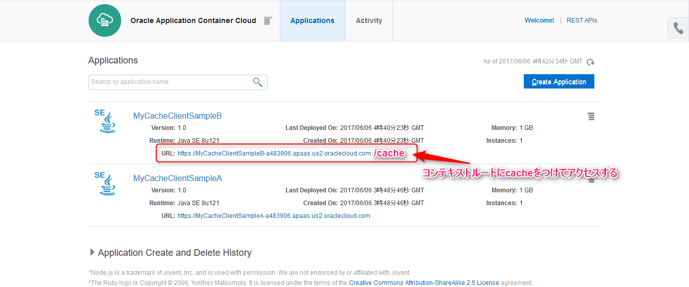

キャッシュ動作するアプリケーションにアクセスします。

#### 5.3. キャッシュを用いたクラスタリングの動作確認

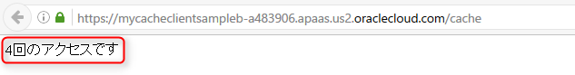

各アプリケーションのアクセス数を共有してそれぞれカウントアップしていきます。

## Licence

Released under the [MIT license](https://gist.githubusercontent.com/shinyay/56e54ee4c0e22db8211e05e70a63247e/raw/44f0f4de510b4f2b918fad3c91e0845104092bff/LICENSE)

## Author

[shinyay](https://github.com/shinyay)
