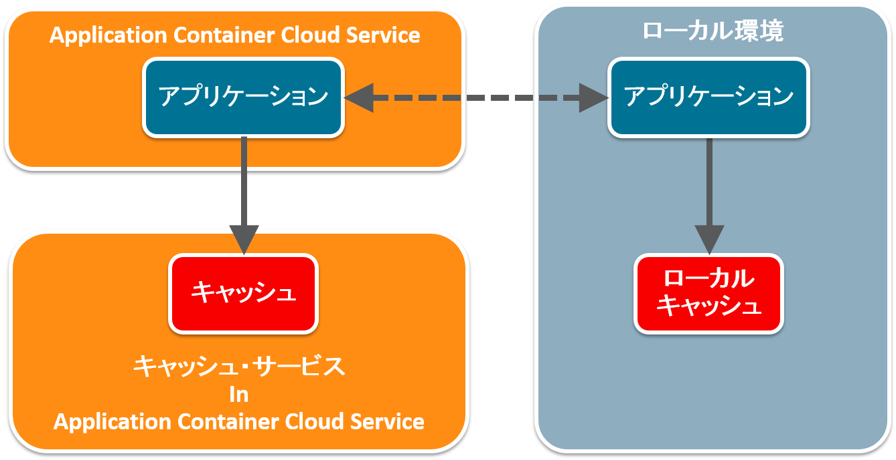

# Using Application Caches in Local



Oracle Application Container Cloud Service はキャッシュ機能を提供しています。

- [Application Container Cloud Service のキャッシュ機能を使ってみた](http://qiita.com/shinyay/items/72a8e4288e908d9d01c1)

このキャッシュ機能の開発を簡単に行えるように **ローカルキャッシュ** 機能が利用できます。

## 説明

Oracle Application Container Cloud Service が提供している Application Cache は稼働しているホスト名を環境変数から取得して、キャッシュの宛先として利用します。
そのため、キャッシュ機能を利用するには Application Container Cloud Service 上に Application Cache インスタンスが作成され起動している事が前提となります。

- [参考: キャッシュ初期化](http://qiita.com/shinyay/items/72a8e4288e908d9d01c1#1-%E5%88%9D%E6%9C%9F%E5%8C%96)

開発時にリモートに接続し、テストやデバッグを行うのは不便です。そこで、Application Cache Client が提供している **LocalCache** API を利用します。

### LocalCache

LocalCache は実際の Application Container Cloud Service 上の Cache を利用する場合の API と同様の API が提供されています。


上記クラス図を見ると分かるように、**Cache インターフェース** を実装した **AbstractCache** 抽象クラスを継承して **REST** 処理用、**gRPC** 処理用、**ローカル** 処理用の各クラスが作られています。

### RestCache / GrpcCahe

「[Application Container Cloud Service のキャッシュ機能を使ってみた](http://qiita.com/shinyay/items/72a8e4288e908d9d01c1)」で作成したキャッシュは、**Transport** クラスで **REST** タイプを指定していました。それにより **RestCache** として定義されています。

```java
cacheSession = sessionProvider.createSession(Transport.rest());
```

また、指定する Transport タイプを **gRPC** にすると **GrpcCache** として定義されます。

## 機能
`LocalCache`、 `RestCache`、`GrpcCache` ともに基本的な機能に違いはありません。

- キャッシュの取得
  - `get(String key)`
- キャッシュの登録
  - `put(String key, V value, PutOption... options)`
- キャッシュの更新
  - `replace(String key, V value, ReplaceOption... options)`
- キャッシュの削除
  - `remove(String key, RemoveOption... options)`

## 前提

キャッシュ・サービスのクライアント・アプリケーションに Java API を利用する場合は、以下のライブラリが必要になります。

- cache-client-api-1.0.0.jar

Maven により以下の依存関係を記述することで取得可能:

- Artifact ID: **cache-client-api**
  - Group ID: **com.oracle.cloud.caching**

```xml
<dependency>
    <groupId>com.oracle.cloud.caching</groupId>
    <artifactId>cache-client-api</artifactId>
    <version>1.0.0</version>
</dependency>
```

## 使用方法 / 実装例

Application Container Cloud Service 上で稼働させる場合と、ローカル環境で稼働させる場合で使用する Cache を切り替えると便利です。
そこで、Application Container Cloud Service 上かローカル環境かという識別情報として環境変数を利用してみます。

Application Container Cloud Servive では、デプロイしたアプリケーションファイルが配置される場所の情報として **APP_HOME** という環境変数でディレクトリ名が登録されています。そこで、この環境変数の有無を利用して環境差異を判別することにします。


### 環境判別処理を入れる前

```java
Session cacheSession = new RemoteSessionProvider(CACHE_URL).createSession(Transport.rest());
Cache cache = cacheSession.getCache(CACHE_NAME, ValueType.of(String.class));
```


### 環境判別処理をいれた後

```java
SessionProvider sessionProvider = System.getenv(APP_HOME_DIR) == null ? new LocalSessionProvider() : new RemoteSessionProvider(CACHE_URL);
Session cacheSession = new RemoteSessionProvider(CACHE_URL).createSession(Transport.rest());
Cache cache = cacheSession.getCache(CACHE_NAME, ValueType.of(String.class));
```

SessionProvider を環境変数の有無で切り替えています。

## ローカル環境での Application Cache の実行例

### RestCache を使用した場合のローカルアクセス


### LocalCache を使用した場合のローカルアクセス


